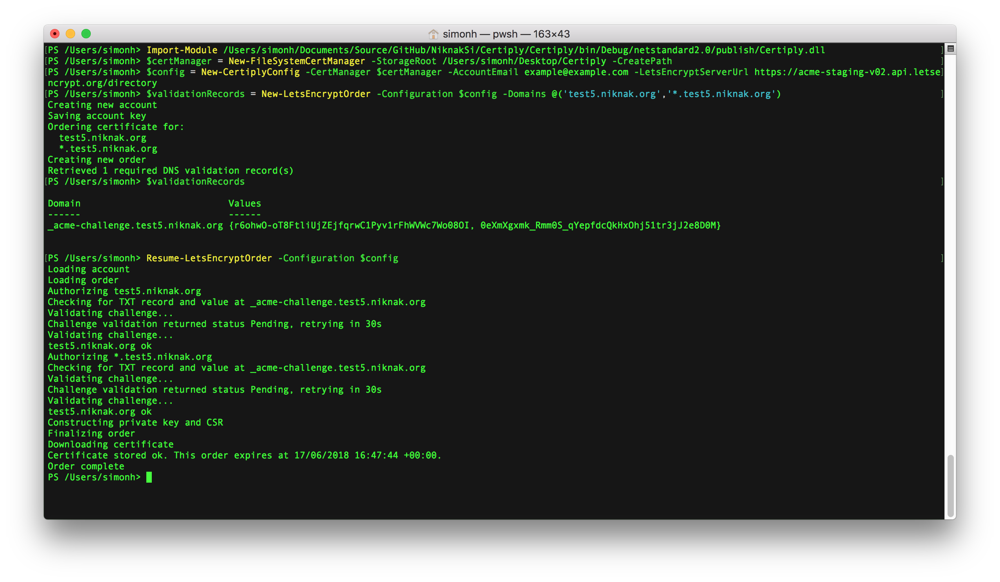

# Certiply
The goal for this project is to allow for Let's Encrypt certificate ordering directly from a TFS/VSTS build or release definition. To achieve this I've used the [certes](https://github.com/fszlin/certes) ACME client and wrapped it with enough extra logic and safety to drive it with some simple PowerShell cmdlets.

It's written in C# using .NET Standard 2.0 and runs using PowerShell 6 (Core) on Windows, Linux, and Mac, or 5.1 on Windows. There are no releases yet so you'll need to build it yourself for now.

Only DNS validation is supported and eventually Certiply will support automatic record creation using Azure DNS Zones.

## Usage
Certiply has a concept of a 'certificate manager' which is basically just somewhere that your Let's Encrypt account and subsequent orders are held. Currently there is only a local file system based cert manager, but I have plans for cert managers that use Azure Key Vault and SQL Server. This is important for sharing account keys between multiple build agents.

1. Compile the code
2. Import the module into a PowerShell session
```PowerShell
Import-Module /Users/simonh/Documents/Source/GitHub/NiknakSi/Certiply/Certiply/bin/Debug/netstandard2.0/publish/Certiply.dll
```
3. Create a new certificate manager object
```PowerShell
$certManager = New-FileSystemCertManager -StorageRoot /Users/simonh/Desktop/Certiply -CreatePath
```
4. Create a new Certiply configuration object. Note that in this example I'm specifying the staging URL for Let's Encrypt, but by default the production URL will be used. Inspect the `New-CertiplyConfig` cmdlet for more configuration settings.
```PowerShell
$config = New-CertiplyConfig -CertManager $certManager -AccountEmail example@example.com -LetsEncryptServerUrl https://acme-staging-v02.api.letsencrypt.org/directory 
```
5. Create a new order and retrieve the DNS validation details
```PowerShell
$validationRecords = New-LetsEncryptOrder -Configuration $config -Domains @('test5.niknak.org','*.test5.niknak.org')
```
6. Action the DNS validation records manually
7. Resume the order to complete the process
```PowerShell
Resume-LetsEncryptOrder -Configuration $config
```
8. Inspect the contents of the `$certManager` object or the file system specified for the .pem files.




If you would prefer you an also use `Invoke-NewLetsEncryptOrder` to do an interactive order, whereby the cmdlet will simply wait for the DNS records to appear before continuing with validation. This is handy for testing but does not represent how orders will be placed by a build/release extension.

## Todo
Lots!

- Support for cancellation tokens
- Document the cmdlets
- Creation of simple TFS/VSTS extension
- Use a DNS zone in Azure for the DNS validation records
- Create additional cert managers to allow the same account to be used across build agents
- Refactoring and tidying up
- Better documentation
- Publish the extension on the VSTS Marketplace
